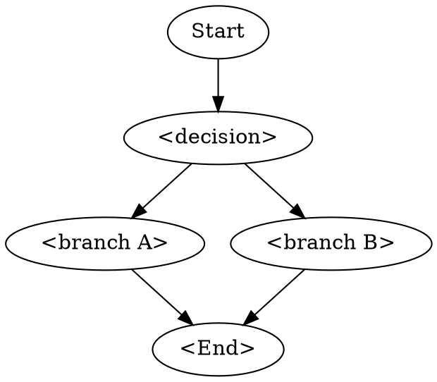

# <Skill Title>

> <one-line scope statement>

## When to use

- <situation requiring this flow>

## Pre-requisites

- **Inputs:** <what must exist before starting>
- **Tool versions:** <minimum versions, vendor-neutral>
- **Prior skills:** <links to skills whose output feeds this one>

## Procedure

1. **<Step name>** — <what + why>
   - How to verify: <objective check>
   - Vendor: `Vivado:` ... | `DC:` ... | `Genus:` ... | `VCS:` ... | `Questa:` ... | `Verilator:` ...
2. **<Step name>** — <what + why>
   - How to verify: <objective check>
3. ...

## Decision flowchart

## Validation gates

- **Gate 1:** <condition that must hold before proceeding to next step>
- **Gate 2:** ...

## Common failure modes & recovery

| Symptom | Likely cause | Fix |
|---|---|---|
| <observed failure> | <root cause> | <recovery action> |

## Citations

<Same rule as coding template — cite normative rules only.>

## See also

- `references/<vendor>.md` — vendor-specific deviations
- `examples/<name>/` — worked closure example with logs
