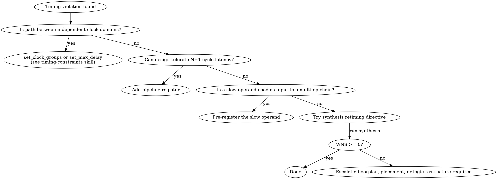

# Synthesis Guidelines

> End-to-end checklist for writing RTL that synthesizes correctly, meets timing, and produces a gate-level netlist ready for simulation — covering Vivado and Design Compiler (DC/Genus).

## When to use

- Writing new RTL that must synthesize without latches, loops, or resource-inference surprises
- Selecting or verifying synthesis attributes (`use_dsp`, `ram_style`, `dont_touch`)
- Debugging timing violations (WNS < 0) after synthesis
- Preparing a netlist for gate-level simulation (GLS)

## Pre-requisites

- **Inputs:** RTL source files (SystemVerilog preferred), target technology (FPGA part or ASIC library), clock frequency goal
- **Tool versions:** Vivado 2022.1+ or Synopsys DC 2022.03+ / Cadence Genus 21.1+
- **Prior skills:** `timing-constraints` (SDC must exist before synthesis run)

## Procedure

### Step 1 — Write synthesis-friendly RTL

Use `always_ff` for all sequential logic; use `always_comb` with default assignments for all combinational logic to prevent latch inference.

- Reset: single `rst_n`, asynchronous active-low. Canonical form:
  ```systemverilog
  always_ff @(posedge clk or negedge rst_n) begin
      if (!rst_n) q <= '0;
      else        q <= d;
  end
  ```
- Avoid relying on `initial` blocks for reset-equivalent behavior: ASIC synthesis (DC/Genus) silently ignores them; Vivado and Quartus synthesize `initial` blocks only for FF/BRAM power-on values (`INIT` attribute), which is not the same as a runtime reset. Use explicit `always_ff` reset paths for all runtime initialization.
- Avoid combinational loops: any path where a combinational output feeds back to its own input without a register. Break every loop with a register.
- Prevent latches with default assignment:
  ```systemverilog
  always_comb begin
      decoded = '0;        // default — no latch regardless of case branches
      unique case (opcode)
          OP_ADD: decoded = ADD_CTRL;
          OP_MUL: decoded = MUL_CTRL;
      endcase
  end
  ```
- `interface` + `modport` are synthesizable; `virtual interface` and class-context interfaces are sim-only.

**How to verify:** Synthesis log shows zero "latch inferred" and zero "combinational loop" warnings.

---

### Step 2 — Apply synthesis attributes/directives

Place attributes immediately before the declaration or module header they govern.

| Attribute / Command | Tool | Effect |
|---|---|---|
| `(* keep = "true" *)` | Vivado | Preserve net name through optimization |
| `(* dont_touch = "true" *)` | Vivado | Prevent cell/net optimization |
| `set_dont_touch [get_cells <name>]` | DC, Genus | Freeze cell from optimization |
| `(* use_dsp = "yes" *)` | Vivado | Prefer DSP block inference (not guaranteed for small widths) |
| `(* use_dsp = "no" *)` | Vivado | Prevent DSP inference; use LUTs |
| `set_dp_smartgen_options -DP_MAP_DSP_MODE prefer` | DC NXT | Prefer DSP mapping (version-specific; check DC manual) |
| `(* ram_style = "block" *)` | Vivado | Force BRAM inference |
| `(* ram_style = "distributed" *)` | Vivado | Force LUT RAM inference |
| `(* ram_style = "registers" *)` | Vivado | Force register array |
| `(* keep_hierarchy = "yes" *)` | Vivado | Prevent boundary optimization |
| `set_boundary_optimization false` | DC | Preserve module boundaries |

> Attributes in RTL are non-portable. Wrap in `` `ifdef SYNTHESIS `` where the attribute would break a non-Vivado flow.

**How to verify:** Synthesis utilization report shows expected DSP/BRAM/LUT counts matching attribute intent.

---

### Step 3 — Configure timing constraints

Timing constraints (SDC) **must exist before synthesis** so the tool can optimize logic toward the timing goal. See `timing-constraints` skill for full SDC authoring.

Key points for synthesis-only constraint flow:
- Define all clocks with `create_clock` before `synth_design` (Vivado) or `compile_ultra` (DC).
- Set input/output delays relative to clock so the tool sizes the I/O paths.
- Use `set_clock_groups -asynchronous` for independent clocks — do not leave cross-domain paths unconstrained.

**Vivado:** `read_xdc constraints.xdc` before `synth_design -top <top> -part <part>`
**DC:** `source constraints.sdc` before `compile_ultra`

**How to verify:** `check_timing` (Vivado) / `check_timing -verbose` (DC) — zero unconstrained endpoints.

---

### Step 4 — Run synthesis and check QoR

After synthesis completes, check timing and area quality-of-results (QoR).

- **Timing:**
  ```tcl
  # Vivado
  report_timing_summary -file timing_summary.rpt

  # DC
  report_timing -max_paths 10 -path_type full
  ```
  Target: WNS (worst negative slack) ≥ 0 on all path groups.

- **Area / utilization:**
  ```tcl
  # Vivado
  report_utilization -file utilization.rpt

  # DC
  report_area -hierarchy
  ```
  Check LUTs, BRAMs, DSPs against design budget.

**How to verify:** Timing report shows no critical paths (WNS ≥ 0); utilization report within budget.

---

### Step 5 — Fix critical-path violations

Apply fixes in this order (least invasive first):

**a. Pipeline register** — insert a register between long-path stages. Adds 1-cycle latency, enables higher clock frequency.
```systemverilog
// Stage 1: multiply
always_ff @(posedge clk) product <= a * b;
// Stage 2: add
always_ff @(posedge clk) result  <= product + c;
```

**b. Operand pre-registration** — if a slow operand (e.g., configuration value) is stable cycle-to-cycle, register it one cycle early so the multiply/add has a full clock cycle.

**c. Retiming** — tool redistributes registers across combinational logic without changing I/O behavior:
```tcl
# Vivado — global retiming at synthesis time (enable before synth_design)
set_property -name {STEPS.SYNTH_DESIGN.ARGS.MORE OPTIONS} \
    -value {-retiming} -objects [get_runs synth_1]
# Or per-cell (Vivado 2019.1+):
set_property RETIMING true [get_cells u_mult*]

# DC
set_boundary_optimization true
optimize_registers -forward
```

**d. Adder tree restructuring** — write flat sums; avoid forcing left-to-right evaluation:
```systemverilog
// Allows tool to balance tree:
assign sum = a + b + c + d;
// NOT: assign sum = ((a + b) + c) + d;
```

**How to verify:** Re-run `report_timing_summary`; WNS ≥ 0 on all path groups.

---

### Step 6 — Gate-level simulation readiness

Before handing the netlist to GLS:

- **`initial` blocks:** synthesis ignores them. Any signal initialized only by an `initial` block (not by reset) will be X in GLS. Replace every `initial`-based initialization with a proper reset assignment in `always_ff`.
- **X-propagation:** default 4-state GLS applies standard X-masking rules (e.g., `0 & X = 0`), which can hide reset-coverage bugs that synthesis would not mask. Enable tool-specific pessimistic X-prop mode (`xprop` in Xcelium, `+xprop` in VCS) for thorough coverage. Either way, full reset coverage — every register reachable by the reset sequence — is required.
- **Reset polarity:** active-low `rst_n` in RTL maps to `FDCE` (negative-edge clear) in Xilinx libraries; active-high libraries (some ASIC cells) invert the reset net silently. Verify library cell reset pin polarity matches RTL coding.
- **SDF annotation** (post-implementation only): back-annotate with `$sdf_annotate("design.sdf", top_tb.dut)` in the testbench for timing-accurate GLS.

**How to verify:** Post-synthesis GLS runs clean with zero X-propagation failures at reset assertion and deassertion.

---

## Decision flowchart



## Validation gates

- **Gate 1:** No latch inference warnings in synthesis log
- **Gate 2:** No combinational loop warnings in synthesis log
- **Gate 3:** `check_timing` (Vivado) / `check_timing -verbose` (DC) — zero unconstrained paths
- **Gate 4:** WNS ≥ 0 on all path groups after synthesis
- **Gate 5:** Resource utilization (BRAMs, DSPs, LUTs) within design budget
- **Gate 6:** Gate-level simulation passes with no X-propagation failures on reset sequence

## Common failure modes & recovery

| Symptom | Likely cause | Fix |
|---|---|---|
| Latch inferred on case output | Output not assigned in all branches | Add `decoded = '0;` default before `case`; use `unique case` |
| Gate-level sim X after reset | `initial` block sets sim state; synthesis ignores it | Replace `initial` with explicit reset assignment in `always_ff` |
| WNS −0.3 ns on multiplier-adder | Multiply + add exceeds 1 cycle in target tech | Pipeline: register between multiply and add stages |
| DSP not inferred, uses LUTs | Tool does not recognize multiply pattern | Add `(* use_dsp = "yes" *)` attribute; use `$signed` operands |
| Critical register optimized away | Tool removes register with no fanout in context | Add `(* dont_touch = "true" *)` (Vivado) or `set_dont_touch` (DC) |
| Reset polarity mismatch in GLS | RTL uses active-low; library cell is active-high | Check library cell reset pin; fix mapping or add explicit inverter |

## Citations

- IEEE 1800-2017 §9.2.2 — `always_comb` implicit sensitivity and time-0 evaluation guarantee
- IEEE 1800-2017 §9.4.2 — `always_ff` sequential block semantics
- Vivado Design Suite User Guide UG901 — Synthesis Attributes
- Synopsys DC User Guide — `compile_ultra`, `optimize_registers`, `set_dont_touch`

## See also

- `references/rtl-coding-for-synthesis.md` — latch inference, combinational loops, reset coding, interface synthesis, X-propagation
- `references/synthesis-attributes.md` — full attribute reference table for Vivado and DC/Genus
- `references/timing-optimization.md` — pipelining, operand pre-registration, retiming, adder trees, DSP cascading
- `references/gate-level-sim.md` — GLS hazards, X-propagation modes, reset coverage, SDF annotation
- `examples/pipelined_mult_add.sv` — before/after pipelining example with synthesis attributes
- `timing-constraints` skill — SDC authoring, clock groups, multicycle paths
