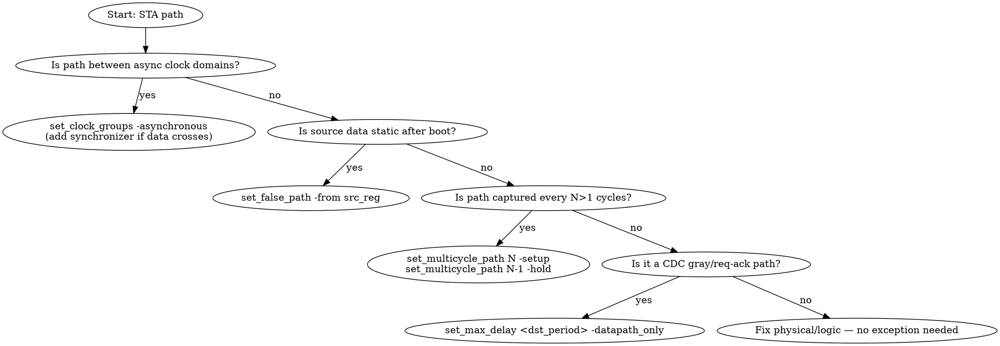

# Timing Constraints

> Author and validate SDC/XDC timing constraints from scratch or in response to
> STA violations, covering clocks, I/O delays, path exceptions, and vendor-specific
> properties.

## When to use

- Writing initial constraints for a new design (clocks, I/O delays, clock groups).
- STA reports setup or hold violations; need to triage whether a constraint or a
  physical fix is required.
- Adding multicycle path or false path exceptions for slow/static registers.
- Crossing clock domains (async FIFO gray pointers, req/ack buses) and need the
  correct `set_max_delay` value.
- Targeting Xilinx Ultrascale+ and need XDC-specific properties beyond standard SDC.
- Asked about source-synchronous vs system-synchronous I/O, DDR constraints, or
  clock group declarations.

## Pre-requisites

- **Inputs:** synthesized netlist or RTL with known clock topology; I/O timing
  specification (setup/hold from data sheet or SoC integration guide).
- **Tool versions:** SDC 1.9+ compatible tool (Vivado, Innovus, DC, Genus); for XDC
  specifics, Vivado 2020.1+.
- **Prior skills:** `synthesis-guidelines` (netlist must exist before full STA);
  `clock-domain-crossing` (CDC structure informs clock groups and max-delay values).

## Procedure

1. **Declare primary clocks** — one `create_clock` per independent oscillator or
   board input clock. Use exact frequency from the clock specification.

   ```tcl
   create_clock -name clk_200 -period 5.000 [get_ports clk_200_p]
   create_clock -name clk_apb -period 20.000 [get_ports clk_apb]
   ```

   - How to verify: `report_clocks` lists all clocks with correct period/waveform.
   - `Vivado:` differential inputs need only the P-side in `get_ports`; the tool
     infers the N-side automatically.

2. **Declare generated clocks** — for PLL/MMCM outputs and clock dividers.

   ```tcl
   create_generated_clock -name clk_100 \
       -source [get_pins pll0/CLKIN1] \
       -divide_by 2 [get_pins pll0/CLKOUT0]
   ```

   - How to verify: `report_clocks` shows the derived relationship; `report_cdc`
     shows no unresolved generated-clock sources.
   - `Vivado:` MMCM/PLL outputs are auto-derived; explicit `create_generated_clock`
     overrides the auto name, which is required for stable constraint references.

3. **Set clock groups** — declare which clocks are asynchronous (no timing analysis
   between them) or exclusive (clock-mux, never active simultaneously).

   ```tcl
   # Three async clocks: Ethernet RX, internal, APB
   set_clock_groups -asynchronous \
       -group [get_clocks clk_eth_rx] \
       -group [get_clocks clk_200] \
       -group [get_clocks clk_apb]
   ```

   - How to verify: `report_clock_interaction` shows "No Analysis" for the grouped
     pairs; CDC tool (Spyglass, Questa CDC) shows no unwaived violations.
   - Note: `set_clock_groups` does not replace synchronizers — every signal crossing
     these domains still needs a 2-FF synchronizer or async FIFO.

4. **Apply I/O delays** — constrain setup (-max) and hold (-min) for every I/O port.
   Use the board-level timing budget (trace delays, external device spec).

   ```tcl
   # System-synchronous input: 2 ns setup, 0.5 ns hold budget
   set_input_delay -clock clk_200 -max 2.0 [get_ports data_in*]
   set_input_delay -clock clk_200 -min 0.5 [get_ports data_in*]

   # Source-synchronous DDR3 PHY input at 400 MHz (2.5 ns period)
   set_input_delay -clock clk_ddr -max 1.0 [get_ports ddr_dq*]
   set_input_delay -clock clk_ddr -min 0.5 [get_ports ddr_dq*]
   set_input_delay -clock clk_ddr -max 1.0 [get_ports ddr_dq*] \
       -clock_fall -add_delay
   set_input_delay -clock clk_ddr -min 0.5 [get_ports ddr_dq*] \
       -clock_fall -add_delay
   ```

   - How to verify: `report_timing -from [get_ports data_in*]` shows constrained
     paths with correct budgets; no unconstrained I/O warnings.
   - See `references/io-delays.md` for source-synchronous vs system-synchronous
     derivation and the full DDR constraint model.

5. **Add path exceptions** — false paths for truly static signals; multicycle paths
   for intentionally slow data paths.

   ```tcl
   # Static config register written once at boot — remove from STA
   set_false_path -from [get_cells cfg_reg*]

   # Slow ALU result, captured every 3 cycles (N=3 multicycle)
   set_multicycle_path 3 -setup -from [get_cells alu_*] -to [get_cells result_*]
   set_multicycle_path 2 -hold  -from [get_cells alu_*] -to [get_cells result_*]
   ```

   - How to verify: `report_exceptions` lists all path exceptions; cross-check that
     no critical paths are accidentally covered.
   - See `references/multicycle-paths.md` for the hold-side compensation rule.

6. **Constrain CDC max-delay paths** — for async FIFO gray pointers and req/ack
   buses, use `set_max_delay -datapath_only` to bound routing without restricting
   clock skew analysis.

   ```tcl
   # Gray pointer from 100 MHz write to 250 MHz read domain
   # Value = destination clock period (4 ns for 250 MHz)
   set_max_delay 4.0 -datapath_only \
       -from [get_pins wr_ptr_gray*/Q] \
       -to   [get_pins rd_sync_reg*/D]
   ```

   - How to verify: `report_timing` on these paths shows arrival ≤ 4.0 ns; no
     `set_false_path` on the same paths (that would remove routing constraints).
   - See `clock-domain-crossing` skill `references/false-path-vs-max-delay.md`.

7. **Apply Xilinx XDC properties** (FPGA targets) — pin assignment, I/O standard,
   clock routing, and floorplanning.

   ```tcl
   set_property PACKAGE_PIN W5    [get_ports clk_200_p]
   set_property IOSTANDARD  LVDS  [get_ports clk_200_p]
   # BACKBONE: directs clock to global backbone routing when not on a CCIO pin.
   # Use FALSE to suppress the DRC warning only (last resort, higher jitter).
   # Preferred: always place clocks on CCIO-capable pins to avoid this entirely.
   set_property CLOCK_DEDICATED_ROUTE BACKBONE [get_nets clk_200_buf]
   ```

   - How to verify: Vivado `report_io` shows all ports placed with valid IOSTANDARD;
     no DRC critical warnings about CLOCK_DEDICATED_ROUTE.
   - See `references/xilinx-xdc.md` for `create_pblock`, `PROHIBIT`, and
     `CLOCK_BUFFER_TYPE`.

## Decision flowchart



## Validation gates

- **Gate 1:** `report_clocks` — zero clocks with unknown period or missing source.
- **Gate 2:** `report_io` (Vivado) / `check_timing` — zero unconstrained I/O paths.
- **Gate 3:** `report_clock_interaction` — all async pairs show "No Analysis".
- **Gate 4:** `report_exceptions` — every exception has a documented rationale.
- **Gate 5:** CDC tool (Spyglass / Questa CDC) — zero unwaived CDC violations.
- **Gate 6:** `report_timing_summary` — worst negative slack ≥ 0 on all path groups.

## Common failure modes & recovery

| Symptom | Likely cause | Fix |
|---|---|---|
| Setup violation on known-static register | Missing `set_false_path` | Add `set_false_path -from [get_cells <reg>*/Q]`; verify with `report_exceptions` |
| Hold violation after adding multicycle setup | `set_multicycle_path -hold` missing | Add `set_multicycle_path N-1 -hold` for the same from/to; see §5 |
| CDC tool flags gray-pointer path | `set_false_path` used instead of `set_max_delay -datapath_only` | Replace with `set_max_delay <dst_period> -datapath_only`; false path removes routing constraint |
| `report_clocks` shows duplicate/spurious generated clocks | Auto-derived MMCM clocks collide with explicit names | Add `create_generated_clock` with explicit `-name` to override auto-derivation |
| `CRITICAL WARNING: clock not reaching destination` (Vivado) | Clock net on non-clock routing resource | Add `set_property CLOCK_DEDICATED_ROUTE BACKBONE [get_nets <net>]` or reroute to a proper clock-capable input |
| I/O unconstrained after adding `set_input_delay` | Port name glob doesn't match elaborated names | Check `get_ports *` output; use `report_io` to confirm port names in the netlist |
| All paths critical after `set_clock_groups` removed | Wrong group membership — clock in two conflicting groups | Audit `report_clock_interaction`; each clock must appear in exactly one group |

## Citations

- **SDC 1.9 (Synopsys SDC Reference Manual)** — `set_multicycle_path`, `set_false_path`,
  `set_max_delay`, `set_clock_groups`: command semantics are normative here; Vivado and
  Innovus implement SDC 1.9 with minor extensions.
- **SDC 1.9 §set_max_delay** — `-datapath_only` flag excludes clock uncertainty and
  skew from the path analysis budget; required for CDC max-delay constraints.

## See also

- `references/clock-declarations.md` — `create_clock`, generated clocks, virtual
  clocks, clock groups; read when setting up a multi-clock design.
- `references/io-delays.md` — `set_input_delay`/`set_output_delay`; source-synchronous
  vs system-synchronous derivation; DDR two-edge model.
- `references/multicycle-paths.md` — `set_multicycle_path` setup and hold mechanics;
  N=3 concrete example with hold compensation.
- `references/xilinx-xdc.md` — Xilinx-specific: `PACKAGE_PIN`, `IOSTANDARD`,
  `CLOCK_DEDICATED_ROUTE`, `create_pblock`, `PROHIBIT`, `CLOCK_BUFFER_TYPE`.
- `examples/constraints.xdc` — annotated XDC for a small design with two clocks,
  I/O delays, false path, and multicycle path.
- `clock-domain-crossing` skill — synchronizer circuits and CDC SDC patterns.
