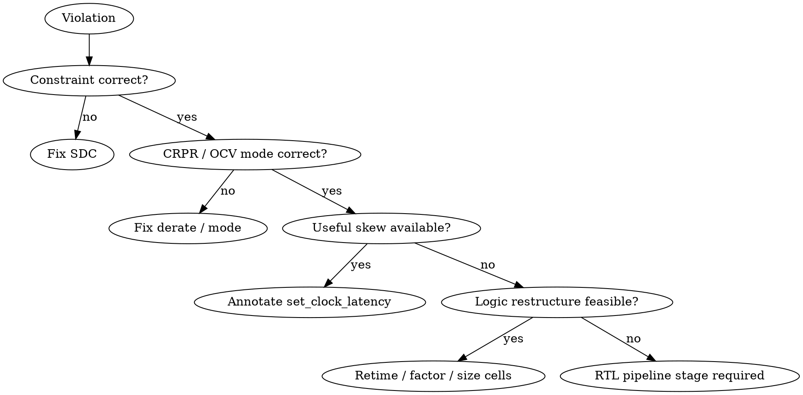

# /sta — Static Timing Analysis Workflow

$ARGUMENTS

---

## Purpose

Drive a design from "first STA run" through clean signoff: read the report,
classify the violation, pick the cheapest fix that doesn't lie, and re-verify
across every required MMMC view.

This workflow assumes constraints exist. Use `/lint` and `/synthesize` first
if the netlist isn't ready; use `timing-constraints` skill for SDC authoring.

## Resources

- **Lead agent:** `timing-analyst`
- **Supporting agents:**
  - `synthesis-engineer` — when a fix needs re-synth (retiming, pipelining, sizing)
  - `rtl-designer` — when RTL changes are required (pipeline stage, factoring)
  - `physical-design-engineer` — for CTS-driven fixes (useful skew, hold buffers)
  - `fpga-specialist` / `asic-specialist` — for tool-specific STA invocations
- **Required skills:**
  - `sta` — analysis, equations, MMMC, OCV/AOCV/POCV, CRPR, SI
  - `timing-constraints` — SDC/XDC authoring; multicycle/false-path syntax
- **Conditional skills:**
  - `clock-domain-crossing` — for paths flagged as CDC max-delay
  - `synthesis-guidelines` — for retiming/pipeline-based fixes
  - `tcl-scripting` — for parsing reports and scripting ECO
  - `vivado-flow` / `synopsys-flow` / `cadence-flow` — vendor-specific commands

---

## Procedure

### Phase 1 — Read the report

1. **Identify the worst path per group.** `report_timing_summary` per path
   group (in→reg, reg→reg, reg→out, in→out). See
   `sta/references/timing-paths.md`.

2. **Pull a `-path_type full_clock_expanded -derate -crosstalk_delta`
   report** on the worst violator. Match each report field to the slack
   equation; see `sta/references/report-timing-deepdive.md` and
   `sta/references/setup-hold-equations.md`.

3. **Confirm corner and mode.** Setup at slow-slow, hold at fast-fast.
   Mode-specific case-analysis active. See
   `sta/references/mmmc-corners.md`.

### Phase 2 — Sanity-check the constraint

Most "violations" are constraint bugs, not logic bugs.

4. **Walk the sanity checklist** from `sta/references/setup-hold-equations.md`
   §"sanity checklist": period correct, uncertainty realistic, derate
   present, CRPR engaged, library numbers plausible.

5. **Audit constraints.** If false-path or multicycle is masking a real
   path, fix it. If a generated clock is misnamed, fix it. Use
   `timing-constraints` for the syntax.

### Phase 3 — Classify the violation

Decision flow:



Cheapest fixes first: constraint > derate > useful skew > logic restructure
> RTL pipeline.

### Phase 4 — Apply the fix

6. **Constraint fix.** Edit SDC; re-run `update_timing`.

7. **Logic restructure / retiming.** Re-synthesize with appropriate
   `compile_ultra -retime` (DC) / `syn_generic -effort high` (Genus) /
   `synth_design -directive PerformanceOptimized` (Vivado).

8. **Useful skew.** `set_clock_latency` hint or enable CTS-driven useful
   skew. See `sta/references/useful-skew.md` — verify hold post-skew.

9. **RTL pipeline.** New pipeline stage in RTL; coordinate with
   `rtl-designer` to preserve I/O latency contracts.

### Phase 5 — Re-verify

10. **Re-run STA on the affected view.** Confirm fix lands.

11. **Re-run STA on *all* views.** A fix in one view can regress another
    (especially hold at FF after a setup fix at SS).

12. **Sign-off gate.** Every view: WNS ≥ 0, TNS ≥ 0, WHS ≥ 0, THS ≥ 0,
    `report_min_pulse_width` clean, `report_clock_skew` within budget,
    SI noise clean on clocks.

---

## Key metrics

| Metric | Goal | Where to look |
|---|---|---|
| WNS | ≥ 0 (target +5–10% margin) | `report_timing_summary` |
| TNS | 0 | `report_timing_summary` |
| WHS | ≥ 0 | `report_timing_summary` |
| THS | 0 | `report_timing_summary` |
| Min pulse width | clean | `report_min_pulse_width` |
| Clock skew | ≤ uncertainty | `report_clock_skew` |
| SI noise on clock | < 0.3 × Vdd | `report_noise -clocks` |
| Unconstrained endpoints | 0 | `check_timing` |

---

## Fixing violations — quick table

| Violation | Cheapest fix | If that fails | Last resort |
|---|---|---|---|
| Setup, reg→reg | Constraint audit | Useful skew | RTL pipeline |
| Setup, in→reg | I/O delay budget | Reduce input launch | Re-spec interface |
| Setup, reg→out | Output delay budget | Output flop closer to pad | Move register |
| Hold, reg→reg | CTS hold buffers | Useful skew negative | Reduce skew at source |
| Min pulse width | Resize clock buffer | Different cell variant | Reduce clock-gating depth |
| SI on clock | Clock shielding | Re-route | Layer assignment |
| Async violation | `set_false_path` | Recovery/removal exception | Re-time async deassert |

See `sta/SKILL.md` "Common failure modes & recovery" for the master table.

---

## Examples

```text
/sta read report timing.rpt — classify the worst path
/sta close WNS on path through u_alu/add_*
/sta sign off MMMC: setup at SS, hold at FF, scan modes
/sta enable AOCV per foundry deck and re-run
/sta investigate why CRPR credit dropped after useful skew
```
