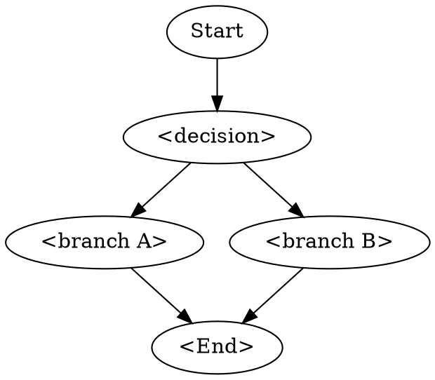

# Wave 0 — Foundation Implementation Plan

> **For agentic workers:** REQUIRED: Use superpowers:subagent-driven-development (if subagents available) or superpowers:executing-plans to implement this plan. Steps use checkbox (`- [ ]`) syntax for tracking.

**Goal:** Land the foundation that makes Wave 1 and Wave 2 of the VLSI Skills Expansion possible — directory templates, a portable build/verify harness, a CI workflow, and a baseline skill-creator eval for the six Wave 1 core skills.

**Architecture:** Add a parallel "build infrastructure" layer to the existing `.agent/skills/` directory: committed skill templates under `.agent/skills/_templates/`, a portable POSIX `Makefile` walker plus per-user `tools.local.mk` overrides, a GitHub Actions workflow that runs `iverilog`-only validation across Linux + Windows, and a committed/reproducible skill-creator eval harness rooted at `.agent/skills/_evals/`.

**Tech Stack:** GNU Make (POSIX-portable), Bash/Git-Bash, GitHub Actions, Icarus Verilog (`iverilog`), Python 3 (skill-creator scripts), Node `npm` packaging.

**Spec:** [docs/specs/2026-04-25-vlsi-skills-expansion-design.md](../specs/2026-04-25-vlsi-skills-expansion-design.md)

---

## File Structure

### Files created in this plan

| Path | Responsibility |
|---|---|
| `.gitignore` | Exclude `tools.local.mk`, `*-workspace/`, common build artifacts |
| `.npmignore` | Belt-and-suspenders: keep `docs/`, `.github/`, `*-workspace/` out of npm tarball |
| `Makefile` | Root entry: `make verify`, `make list-skills`, `make help`. Walks `.agent/skills/*/examples/`. |
| `tools.mk` | Simulator discovery via `PATH` → `VLSI_SIM`/`VLSI_SIM_BIN` env → optional `tools.local.mk` |
| `tools.example.mk` | Committed example showing the convention for users who want a per-machine override |
| `.github/workflows/skills-verify.yml` | CI: `ubuntu-latest` + `windows-latest`, `iverilog` baseline |
| `.agent/skills/_templates/coding-skill-template.md` | Coding-skill template (per spec §6.1) |
| `.agent/skills/_templates/flow-skill-template.md` | Flow-skill template (per spec §6.2) |
| `.agent/skills/_templates/example-Makefile.in` | Example `examples/Makefile` showing tier declaration + tool include |
| `.agent/skills/_templates/README.md` | What the templates are for, how to use them, the `_`-prefix loader-skip rule |
| `.agent/skills/_evals/` | Skill-creator eval harness root (per spec §7.5) |
| `.agent/skills/_evals/README.md` | How to run baseline + post-rewrite evals; reproducibility notes |
| `.agent/skills/_evals/<skill>/evals.json` | Eval prompts for each Wave 1 skill (×6) |
| `.agent/skills/_evals/<skill>/run.sh` | Wrapper that pipes args to skill-creator's `scripts.run_loop` |
| `.agent/skills/<skill>-workspace/iteration-1/` | Baseline eval results for the six Wave 1 skills (×6) |
| `.agent/skills/_fixture/SKILL.md` | Fixture skill used to test the Makefile walker (deleted after CI smoke-tests confirm it works) |
| `.agent/skills/_fixture/examples/Makefile` | Fixture example with tier=`build only` |
| `.agent/skills/_fixture/examples/and_gate.sv` | Trivial 1-gate SV file the fixture compiles |

### Files modified

| Path | Why |
|---|---|
| `package.json` | Add `"verify"` script: `make verify`. Update `files` allowlist if needed. |
| `README.md` | Add a short "Verifying skills locally" section pointing at `make verify`. |

### Files explicitly NOT touched

- `.agent/agents/*` — out of scope (spec §2)
- `.agent/workflows/*` — out of scope (spec §2)
- `.agent/skills/<existing-skill>/SKILL.md` — those get touched in Wave 1, not here. Wave 0 only adds infrastructure around them.
- `bin/cli.js` — npm packaging logic unchanged (spec §2)

---

## Chunk 1: Repository scaffolding

**Goal of chunk:** establish the committed scaffolding (`.gitignore`, `.npmignore`, templates, fixture skill) before any executable infrastructure depends on it.

### Task 1: Create `.gitignore`

**Files:**
- Create: `.gitignore`

- [ ] **Step 1: Write the `.gitignore`**

```
# Per-user simulator/path overrides (spec §7.3)
.agent/tools.local.mk

# Skill-creator eval workspaces — keep aggregated benchmarks; ignore raw runs.
# (Aggregated benchmarks are explicitly re-included with `!` rules below.)
.agent/skills/*-workspace/**/tmp/
.agent/skills/*-workspace/**/*.log
.agent/skills/*-workspace/**/eval-*/
.agent/skills/*-workspace/**/transcripts/
.agent/skills/*-workspace/**/outputs/
!.agent/skills/*-workspace/**/benchmark.json
!.agent/skills/*-workspace/**/benchmark.md

# Build artifacts (simulator output)
*.vvp
*.out
*.jou
*.pb
xsim.dir/
work/
transcript
csrc/
simv*
ucli.key
DVEfiles/

# OS / editor noise
.DS_Store
Thumbs.db
*.swp
.vscode/
.idea/

# Node
node_modules/
npm-debug.log
```

- [ ] **Step 2: Verify nothing currently-tracked gets ignored**

Run:
```bash
git check-ignore -v $(git ls-files) || true
```

Expected: no output (no tracked file matches a new ignore pattern).

- [ ] **Step 3: Commit**

```bash
git add .gitignore
git commit -m "Add .gitignore for per-user overrides and build artifacts"
```

---

### Task 2: Create `.npmignore`

**Files:**
- Create: `.npmignore`
- Modify: `package.json` (only if `files` allowlist needs widening — see step 2)

`package.json` currently uses a `files` allowlist (`["bin", ".agent", "README.md", "LICENSE"]`) which is already restrictive. `.npmignore` is belt-and-suspenders: an extra guard if anyone widens the allowlist later.

- [ ] **Step 1: Write `.npmignore`**

```
# Specs and plans (developer artifacts)
docs/

# CI configuration (not relevant to consumers)
.github/

# Eval workspaces (large, transient, regenerable)
.agent/skills/*-workspace/

# Eval harness internals — keep evals.json + run.sh, ship to consumers
.agent/skills/_evals/**/results/

# Worktree / CI state
.claude/

# Source-control metadata
.git/
.gitignore
```

- [ ] **Step 2: Confirm `package.json` files allowlist still covers what we ship**

Run:
```bash
npm pack --dry-run 2>&1 | head -50
```

Expected: tarball contains `bin/`, `.agent/skills/<all 18 existing>/`, `README.md`, `LICENSE`. **Should NOT contain** `docs/specs/`, `docs/plans/`, `.github/`, or any `*-workspace/` directory.

- [ ] **Step 3: Commit**

```bash
git add .npmignore
git commit -m "Add .npmignore as a guard against future allowlist widening"
```

---

### Task 3: Create skill-template directory + templates

**Files:**
- Create: `.agent/skills/_templates/coding-skill-template.md`
- Create: `.agent/skills/_templates/flow-skill-template.md`
- Create: `.agent/skills/_templates/example-Makefile.in`
- Create: `.agent/skills/_templates/README.md`

The `_` prefix is the **loader-skip convention** (spec §6.3): any directory under `.agent/skills/` whose name begins with `_` is metadata, not a skill. `Makefile` walker, skills index, and the kit's documentation must all respect this.

- [ ] **Step 1: Write `.agent/skills/_templates/README.md`**

```markdown
# Skill templates

Use these as starting points when writing a new VLSI skill.

## Naming convention: `_`-prefix dirs are metadata

Any directory under `.agent/skills/` whose name starts with `_` (this one,
`_evals/`, fixture dirs) is **NOT a skill**. The root `Makefile` walker
and the skills index in `.agent/skills/README.md` skip them.

## Picking a template

| Skill type | Template | Examples |
|---|---|---|
| **Coding skill** — code constructs, idioms, anti-patterns | `coding-skill-template.md` | `fsm-design`, `fifo-design`, `axi-protocols` |
| **Flow skill** — numbered procedure, decision flowchart, validation gates | `flow-skill-template.md` | `clock-domain-crossing`, `synthesis-guidelines`, `simulation-flows` |

## Using a template

```bash
# Copy template into a new skill directory
cp -r .agent/skills/_templates/coding-skill-template.md \
      .agent/skills/<new-skill>/SKILL.md
mkdir -p .agent/skills/<new-skill>/{references,examples}
cp .agent/skills/_templates/example-Makefile.in \
   .agent/skills/<new-skill>/examples/Makefile
```

Then fill in the frontmatter, body, and at least one worked example.
```

- [ ] **Step 2: Write `.agent/skills/_templates/coding-skill-template.md`**

```markdown
---
name: <skill-name>
description: <one-line trigger description used by skill routing>
type: coding
---

# <Skill Title>

> <one-line scope statement>

## When to use

- <triggering situation 1>
- <triggering situation 2>

## Quick reference

| Pattern | Use when | Anti-pattern |
|---|---|---|
| <Pattern A> | <context> | <opposite to avoid> |

## Core patterns

### <Pattern 1>

- **Use when:** <conditions>
- **Code:**

  ```systemverilog
  // canonical snippet (≤25 lines)
  ```

- **Gotchas:** <common mistakes>

> Variants and edge cases live in `references/<topic>.md`.

### <Pattern 2>

...

## Anti-patterns (do NOT do this)

1. <Anti-pattern with brief why>
2. <Anti-pattern with brief why>

## Validation checklist (before declaring code "done")

- [ ] <objective check>
- [ ] <objective check>

## Citations

<Cite IEEE 1800 / AMBA / vendor UG only when stating a normative rule.
See spec §5 for cite-vs-skip examples. Skip this section if there's
nothing to cite.>

## See also

- `references/<topic>.md` — <what's there, when to read>
- `examples/<name>.sv` — worked example
```

- [ ] **Step 3: Write `.agent/skills/_templates/flow-skill-template.md`**

```markdown
---
name: <skill-name>
description: <one-line trigger description used by skill routing>
type: flow
---

# <Skill Title>

> <one-line scope statement>

## When to use

- <situation requiring this flow>

## Pre-requisites

- **Inputs:** <what must exist before starting>
- **Tool versions:** <minimum versions, vendor-neutral>
- **Prior skills:** <links to skills whose output feeds this one>

## Procedure

1. **<Step name>** — <what + why>
   - How to verify: <objective check>
   - Vendor: `Vivado:` ... | `DC:` ... | `Genus:` ... | `VCS:` ... | `Questa:` ... | `Verilator:` ...
2. **<Step name>** — <what + why>
   - How to verify: <objective check>
3. ...

## Decision flowchart



## Validation gates

- **Gate 1:** <condition that must hold before proceeding to next step>
- **Gate 2:** ...

## Common failure modes & recovery

| Symptom | Likely cause | Fix |
|---|---|---|
| <observed failure> | <root cause> | <recovery action> |

## Citations

<Same rule as coding template — cite normative rules only.>

## See also

- `references/<vendor>.md` — vendor-specific deviations
- `examples/<name>/` — worked closure example with logs
```

- [ ] **Step 4: Write `.agent/skills/_templates/example-Makefile.in`**

```make
# Template for a skill's examples/Makefile.
# Copy to <skill>/examples/Makefile and fill in.
#
# Tier declaration (REQUIRED) — pick exactly one. Use the EXACT token,
# no spaces around `:=`, no trailing whitespace (Make is sensitive to that):
#   build-sim          : compile + elaborate + run self-checking testbench
#   build-only         : compile + elaborate, no run
#   tool-output        : run a tool script and diff against expected log
#   needs-vendor-sim   : skip on iverilog-only CI; manual diff against expected log
#   manual-review      : no automated check (last resort; document why)
tier := build-sim

# Source files (relative to this Makefile)
SRCS := $(wildcard *.sv)

# Top-level testbench module name
TOP  := tb_<name>

# REPO_ROOT is set by the root Makefile when it recurses via `$(MAKE) -C`.
# For direct invocation (cd into examples/ and run `make`), fall back to
# climbing four levels up: examples/ -> <skill>/ -> skills/ -> .agent/ -> repo
REPO_ROOT ?= $(abspath $(CURDIR)/../../../..)

include $(REPO_ROOT)/tools.mk

.PHONY: verify clean

verify: $(SIM_VERIFY_TARGET)

clean:
	$(SIM_CLEAN)
```

- [ ] **Step 5: Verify the templates render as Markdown without broken frontmatter**

Run:
```bash
head -5 .agent/skills/_templates/coding-skill-template.md
head -5 .agent/skills/_templates/flow-skill-template.md
```

Expected: both start with `---`, have `name:`, `description:`, `type:`, then closing `---`.

- [ ] **Step 6: Commit**

```bash
git add .agent/skills/_templates/
git commit -m "Add skill templates (coding, flow) and template README

Per spec §6 — coding-skill template for code-construct reference skills,
flow-skill template for numbered-procedure skills. Documents the
underscore-prefix loader-skip convention (spec §6.3)."
```

---

### Task 4: Create the fixture skill

**Files:**
- Create: `.agent/skills/_fixture/SKILL.md`
- Create: `.agent/skills/_fixture/examples/Makefile`
- Create: `.agent/skills/_fixture/examples/and_gate.sv`
- Create: `.agent/skills/_fixture/examples/tb_and_gate.sv`

The fixture is a minimal "skill" used to smoke-test the Makefile walker. It will be removed once the walker has been validated by CI.

- [ ] **Step 1: Write the fixture SKILL.md**

```markdown
---
name: _fixture
description: TEST-ONLY fixture for validating the Makefile walker. Not a real skill.
type: coding
---

# Fixture (test-only)

This directory exercises the root `Makefile` walker against a known-good
worked example. Removed in a later task once CI confirms the walker works.
```

- [ ] **Step 2: Write `.agent/skills/_fixture/examples/and_gate.sv`**

```systemverilog
module and_gate (
    input  logic a,
    input  logic b,
    output logic y
);
    assign y = a & b;
endmodule
```

- [ ] **Step 3: Write `.agent/skills/_fixture/examples/tb_and_gate.sv`**

```systemverilog
module tb_and_gate;
    logic a, b, y;
    int errors = 0;

    and_gate dut (.a(a), .b(b), .y(y));

    initial begin
        // Truth-table sweep
        {a, b} = 2'b00; #1; if (y !== 1'b0) errors++;
        {a, b} = 2'b01; #1; if (y !== 1'b0) errors++;
        {a, b} = 2'b10; #1; if (y !== 1'b0) errors++;
        {a, b} = 2'b11; #1; if (y !== 1'b1) errors++;

        if (errors == 0)
            $display("PASS: and_gate truth table");
        else
            $fatal(1, "FAIL: and_gate had %0d errors", errors);
    end
endmodule
```

- [ ] **Step 4: Write `.agent/skills/_fixture/examples/Makefile`**

The Makefile cannot be tested standalone yet (it `include`s `tools.mk` which doesn't exist until Task 6). For now, write the file but verify it later.

```make
tier := build-sim

SRCS := and_gate.sv tb_and_gate.sv
TOP  := tb_and_gate

# REPO_ROOT is supplied by the root Makefile when it recurses into
# us via `$(MAKE) -C ...`. As a fallback for direct invocation,
# climb three levels up from this file.
REPO_ROOT ?= $(abspath $(CURDIR)/../../../..)

include $(REPO_ROOT)/tools.mk

.PHONY: verify clean

verify: $(SIM_VERIFY_TARGET)

clean:
	$(SIM_CLEAN)
```

- [ ] **Step 5: Commit**

```bash
git add .agent/skills/_fixture/
git commit -m "Add _fixture skill for Makefile walker smoke tests

Trivial AND-gate testbench used to verify the walker compiles and runs
worked examples end-to-end. Removed once Wave 0 CI confirms it works."
```

---

## Chunk 2: Build infrastructure

**Goal of chunk:** ship the portable Make rules (`tools.mk`, root `Makefile`) and confirm the fixture skill from Chunk 1 builds end-to-end.

### Task 5: Create `tools.example.mk`

**Files:**
- Create: `tools.example.mk`

The `.local.mk` file is per-machine and gitignored; `tools.example.mk` is the committed reference users copy from.

- [ ] **Step 1: Write `tools.example.mk`**

```make
# tools.example.mk — copy to .agent/tools.local.mk to override defaults
#
# DO NOT EDIT THIS FILE. Copy it:
#   cp tools.example.mk .agent/tools.local.mk
# then edit your copy. The .local.mk is gitignored.
#
# The build harness picks a simulator in this order:
#   1. PATH lookup (default — works if you `source settings64.sh` first)
#   2. VLSI_SIM env var (e.g., VLSI_SIM=xsim, iverilog, vcs, xrun, vsim)
#   3. VLSI_SIM_BIN env var (full path to the bin directory)
#   4. .agent/tools.local.mk (this file's contents, if you set them)
#
# Variables you can override:
#
#   VLSI_SIM     — which simulator to use. One of:
#                    xsim     (Xilinx Vivado xsim)
#                    iverilog (Icarus Verilog — license-free, default in CI)
#                    vcs      (Synopsys VCS)
#                    xrun     (Cadence Xcelium)
#                    vsim     (Mentor/Siemens Questa/ModelSim)
#
#   VLSI_SIM_BIN — full path to the bin directory containing the simulator
#                    binaries. Only needed if the simulator is not on PATH.
#
# Example overrides (uncomment ONE block):
#
# # Vivado xsim (Windows or Linux)
# VLSI_SIM     := xsim
# VLSI_SIM_BIN := /opt/Xilinx/2024.2/Vivado/bin
#
# # Icarus Verilog (default if PATH already has it)
# VLSI_SIM     := iverilog
#
# # VCS
# VLSI_SIM     := vcs
# VLSI_SIM_BIN := /tools/synopsys/vcs/U-2023.03/bin
```

- [ ] **Step 2: Commit**

```bash
git add tools.example.mk
git commit -m "Add tools.example.mk documenting per-user simulator override convention

Users copy this to .agent/tools.local.mk (gitignored) to point the build
harness at their local simulator install when PATH-based discovery isn't
sufficient. Spec §7.3."
```

---

### Task 6: Create `tools.mk`

**Files:**
- Create: `tools.mk`

`tools.mk` is the discovery + simulator-rule-selection logic. Each skill's `examples/Makefile` includes it relative-pathwise.

- [ ] **Step 1: Write the failing fixture verify**

This is our "test" for `tools.mk`: try to build the fixture without `tools.mk` existing yet.

Run:
```bash
make -C .agent/skills/_fixture/examples verify
```

Expected: FAIL with `Makefile:9: ../../../tools.mk: No such file or directory` or similar.

- [ ] **Step 2: Write `tools.mk`**

```make
# tools.mk — simulator discovery and rule selection
#
# Included by every <skill>/examples/Makefile. Picks a simulator using:
#   1. PATH lookup
#   2. VLSI_SIM env var (overrides PATH choice)
#   3. .agent/tools.local.mk (optional, gitignored)
#
# Defines, for use by includer:
#   $(SIM_VERIFY_TARGET) — the make target that performs the tier's verify
#   $(SIM_CLEAN)         — shell snippet that removes simulator artifacts
#
# Required from includer (before including this file):
#   REPO_ROOT — absolute path to the repo root (set by includer; we DO NOT
#                guess via $(MAKEFILE_LIST) because that's fragile across
#                recursive invocations and includer locations).
#   tier      — one of: build-sim, build-only, tool-output, needs-vendor-sim,
#                manual-review (hyphenated to avoid Make whitespace foot-guns).
#   SRCS      — list of source files
#   TOP       — top-level module (testbench for build-sim, DUT for build-only)

SHELL := /bin/sh

ifndef REPO_ROOT
$(error tools.mk: REPO_ROOT must be set by includer (typically the skill's examples/Makefile))
endif

# 1. Optional per-user override (silent if absent). Anchored to REPO_ROOT —
#    no MAKEFILE_LIST guessing.
-include $(REPO_ROOT)/.agent/tools.local.mk

# 2. Resolve simulator: env var wins, else first one found on PATH.
#    Note: command -v works in both bash and dash; SHELL := /bin/sh forces
#    a POSIX shell so this is portable across Linux/macOS/Git-Bash.
ifndef VLSI_SIM
  ifneq (,$(shell command -v iverilog 2>/dev/null))
    VLSI_SIM := iverilog
  else ifneq (,$(shell command -v xsim 2>/dev/null))
    VLSI_SIM := xsim
  else ifneq (,$(shell command -v vcs 2>/dev/null))
    VLSI_SIM := vcs
  else ifneq (,$(shell command -v xrun 2>/dev/null))
    VLSI_SIM := xrun
  else ifneq (,$(shell command -v vsim 2>/dev/null))
    VLSI_SIM := vsim
  endif
endif

# 3. Apply VLSI_SIM_BIN if user provided it
ifdef VLSI_SIM_BIN
  SIM_PREFIX := $(VLSI_SIM_BIN)/
else
  SIM_PREFIX :=
endif

# 4. Bail out clearly if nothing is found
ifndef VLSI_SIM
$(error No SystemVerilog simulator found on PATH. Expected one of: xsim, iverilog, vcs, xrun, vsim. Either add the simulator to PATH (typical: `source <vendor>/settings64.sh`) or set VLSI_SIM in .agent/tools.local.mk (see tools.example.mk))
endif

# 5. Validate tier early so typos fail loud, not silent
VALID_TIERS := build-sim build-only tool-output needs-vendor-sim manual-review
ifeq ($(filter $(tier),$(VALID_TIERS)),)
$(error tools.mk: tier='$(tier)' is not one of: $(VALID_TIERS). Check for trailing whitespace in your Makefile's `tier := ...` line.)
endif

# 6. Tier-aware skips (do NOT depend on simulator)
ifeq ($(tier),manual-review)
SIM_VERIFY_TARGET := manual-review-skip
SIM_CLEAN         := @true
manual-review-skip:
	@echo "[SKIP] tier=manual-review for $(CURDIR) — see SKILL.md for review notes"
endif

ifeq ($(tier),needs-vendor-sim)
  ifeq ($(VLSI_SIM),iverilog)
SIM_VERIFY_TARGET := needs-vendor-sim-skip
SIM_CLEAN         := @true
needs-vendor-sim-skip:
	@echo "[SKIP] tier=needs-vendor-sim, VLSI_SIM=iverilog for $(CURDIR) — manual diff required against expected log"
  endif
endif

# 7. Per-simulator rules (only set if SIM_VERIFY_TARGET still empty —
#    skip-paths above take priority)
ifndef SIM_VERIFY_TARGET
ifeq ($(VLSI_SIM),iverilog)
  IVERILOG_FLAGS := -g2012 -Wall

  ifeq ($(tier),build-sim)
SIM_VERIFY_TARGET := iverilog-build-sim
SIM_CLEAN         := rm -f a.out *.vvp

iverilog-build-sim:
	$(SIM_PREFIX)iverilog $(IVERILOG_FLAGS) -s $(TOP) -o a.out $(SRCS)
	$(SIM_PREFIX)vvp a.out
  endif

  ifeq ($(tier),build-only)
SIM_VERIFY_TARGET := iverilog-build-only
SIM_CLEAN         := rm -f a.out

iverilog-build-only:
	$(SIM_PREFIX)iverilog $(IVERILOG_FLAGS) -tnull -s $(TOP) $(SRCS)
  endif
endif

ifeq ($(VLSI_SIM),xsim)
  XVLOG_FLAGS := --sv

  ifeq ($(tier),build-sim)
SIM_VERIFY_TARGET := xsim-build-sim
SIM_CLEAN         := rm -rf xsim.dir *.jou *.pb *.log

xsim-build-sim:
	$(SIM_PREFIX)xvlog $(XVLOG_FLAGS) $(SRCS)
	$(SIM_PREFIX)xelab -debug typical $(TOP) -s $(TOP)_snapshot
	$(SIM_PREFIX)xsim $(TOP)_snapshot -R
  endif

  ifeq ($(tier),build-only)
SIM_VERIFY_TARGET := xsim-build-only
SIM_CLEAN         := rm -rf xsim.dir *.jou *.pb *.log

xsim-build-only:
	$(SIM_PREFIX)xvlog $(XVLOG_FLAGS) $(SRCS)
	$(SIM_PREFIX)xelab $(TOP)
  endif
endif
endif # ifndef SIM_VERIFY_TARGET

# Other simulators (vcs, xrun, vsim) get rules added by skills that need them.
# Wave 0 only ships iverilog + xsim rules — sufficient for Wave 1 templates.
```

- [ ] **Step 3: Run the fixture verify with iverilog**

Run:
```bash
make -C .agent/skills/_fixture/examples verify
```

Expected:
```
iverilog -g2012 -Wall -s tb_and_gate -o a.out and_gate.sv tb_and_gate.sv
vvp a.out
PASS: and_gate truth table
```

- [ ] **Step 4: Run the fixture clean**

Run:
```bash
make -C .agent/skills/_fixture/examples clean
```

Expected: `a.out` and any `.vvp` removed.

- [ ] **Step 5: Verify the no-simulator error path**

Run:
```bash
PATH=/usr/bin:/bin VLSI_SIM= make -C .agent/skills/_fixture/examples verify 2>&1 | head -3
```

(On Windows Git-Bash, this temporarily strips paths; adjust if needed to ensure no simulator is reachable.)

Expected: error mentioning "No SystemVerilog simulator found on PATH" with the remediation hint.

- [ ] **Step 6: Commit**

```bash
git add tools.mk
git commit -m "Add tools.mk: simulator discovery and per-tier verify rules

PATH-based discovery first, env-var override (VLSI_SIM, VLSI_SIM_BIN),
optional per-user .agent/tools.local.mk include. Wave 0 ships rules for
iverilog (license-free baseline) and xsim (vendor-capable); other
simulators are added incrementally as skills require them."
```

---

### Task 7: Create root `Makefile`

**Files:**
- Create: `Makefile`

The root Makefile is the user-facing entry point: `make verify` walks every skill's `examples/` and runs its tier; `make list-skills` prints the index; `make help` prints usage.

- [ ] **Step 1: Write `Makefile`**

```make
# Root Makefile — entry point for skill validation
#
# Usage:
#   make verify       Run every skill's examples/Makefile verify target
#   make list-skills  Print the discovered skill list (skips _-prefixed dirs)
#   make help         Show this help

SHELL := /bin/sh

# Repo root is wherever this Makefile lives. Computed once; passed to
# every recursive $(MAKE) invocation so sub-Makefiles don't have to
# guess via $(MAKEFILE_LIST).
REPO_ROOT := $(abspath $(dir $(lastword $(MAKEFILE_LIST))))

# Discover skills: any subdirectory of .agent/skills/ whose name does
# NOT start with `_`. The underscore convention is documented in
# .agent/skills/_templates/README.md and spec §6.3.
ALL_SKILL_DIRS := $(patsubst %/,%,$(wildcard .agent/skills/*/))
SKILLS         := $(sort $(filter-out _%,$(notdir $(ALL_SKILL_DIRS))))

# Build the list of examples/ that actually exist. A skill without an
# examples/ dir simply doesn't appear here — it doesn't fail verify,
# but it won't pass the spec acceptance criterion either. Wave 1/2 add
# the missing examples/ dirs.
EXAMPLES := $(wildcard $(addsuffix /examples,$(addprefix .agent/skills/,$(SKILLS))))

.PHONY: verify list-skills help fixture-verify

help:
	@echo "Targets:"
	@echo "  make verify          Run every skill's examples/Makefile verify target"
	@echo "  make list-skills     Print the discovered skill list"
	@echo "  make fixture-verify  Build and run the _fixture skill (smoke test)"
	@echo "  make help            Show this help"

list-skills:
	@echo "Discovered skills (underscore-prefixed dirs are skipped):"
	@for s in $(SKILLS); do echo "  $$s"; done

verify:
	@echo "Verifying $(words $(EXAMPLES)) skill examples (REPO_ROOT=$(REPO_ROOT))..."
	@fail=0; \
	for ex in $(EXAMPLES); do \
	  echo "==> $$ex"; \
	  if ! $(MAKE) -C $$ex REPO_ROOT=$(REPO_ROOT) verify; then \
	    echo "  FAILED: $$ex"; \
	    fail=1; \
	  fi; \
	done; \
	if [ $$fail -ne 0 ]; then \
	  echo "VERIFY FAILED for at least one skill"; \
	  exit 1; \
	fi; \
	echo "VERIFY OK"

# Smoke-test entry: only the _fixture skill. We pass through to its
# Makefile with REPO_ROOT so it doesn't need to climb $(CURDIR).
fixture-verify:
	$(MAKE) -C .agent/skills/_fixture/examples REPO_ROOT=$(REPO_ROOT) verify
```

- [ ] **Step 2: Verify `make help`**

Run:
```bash
make help
```

Expected: prints the four target descriptions.

- [ ] **Step 3: Verify `make list-skills` shows 18 existing skills, none prefixed with `_`**

Run:
```bash
make list-skills | sort
```

Expected: lists `asic-flows`, `axi-protocols`, `brainstorming`, `clean-rtl`, `clock-domain-crossing`, `dft-patterns`, `formal-verification`, `fpga-flows`, `fsm-design`, `ip-reuse`, `low-power-design`, `plan-writing`, `synthesis-guidelines`, `systemverilog-patterns`, `tcl-scripting`, `timing-constraints`, `uvm-patterns`, `waveform-debugging` (18 names total). Should NOT include `_templates`, `_fixture`, or `_evals`.

- [ ] **Step 4: Walker TDD — prove the underscore-skip rule with a throwaway dir**

The skip rule is load-bearing — Wave 0 ships templates and (later) `_evals/` under `.agent/skills/`, and they MUST NOT be walked. Instead of trusting visual inspection, prove it.

Run:
```bash
# Create a throwaway underscore dir + a non-underscore probe dir
mkdir -p .agent/skills/_test_skip/examples
mkdir -p .agent/skills/test-include-probe/examples

# Both probes contain a Makefile that would intentionally fail if walked
cat > .agent/skills/_test_skip/examples/Makefile <<'EOF'
verify:
	@echo "BUG: walker descended into _test_skip"; exit 1
EOF
cat > .agent/skills/test-include-probe/examples/Makefile <<'EOF'
verify:
	@echo "PROBE: walker descended into test-include-probe (expected)"; exit 1
EOF

# list-skills MUST include test-include-probe and MUST NOT include _test_skip
make list-skills | grep -q '^  test-include-probe$' \
  && echo "OK: probe dir is listed" \
  || { echo "FAIL: probe not listed"; exit 1; }
make list-skills | grep -q '^  _test_skip$' \
  && { echo "FAIL: _test_skip leaked into list-skills"; exit 1; } \
  || echo "OK: _test_skip is correctly skipped"

# verify MUST descend into test-include-probe (it'll fail loudly) and
# MUST NOT touch _test_skip
make verify 2>&1 | tee /tmp/walker-test.log; true
grep -q "BUG: walker descended into _test_skip" /tmp/walker-test.log \
  && { echo "FAIL: walker entered _test_skip"; exit 1; } \
  || echo "OK: walker did not enter _test_skip"
grep -q "PROBE: walker descended into test-include-probe" /tmp/walker-test.log \
  && echo "OK: walker entered probe dir as expected" \
  || { echo "FAIL: walker did not enter probe"; exit 1; }

# Cleanup probes
rm -rf .agent/skills/_test_skip .agent/skills/test-include-probe
rm -f /tmp/walker-test.log
```

Expected: four `OK:` lines printed. If any `FAIL:` appears, the walker logic in Step 1 needs fixing — most likely the `filter-out _%` pattern.

- [ ] **Step 5: Verify `make fixture-verify` builds and runs the fixture**

Run:
```bash
make fixture-verify
```

Expected: same `PASS: and_gate truth table` output as Task 6 step 3.

- [ ] **Step 6: Verify `make verify` walks the existing skills (no examples/ → walker reports zero examples found, exits 0)**

Run:
```bash
make verify
```

Expected: prints `Verifying 0 skill examples ...` then `VERIFY OK`. None of the existing 18 skills have `examples/` dirs in Wave 0, so `EXAMPLES` is empty and the walker exits 0. Wave 1's first PR adds the first `examples/` dir, at which point this command starts doing real work.

- [ ] **Step 7: Update `package.json` to add a `verify` npm script**

Read `package.json:14-16` (the `scripts` block). Replace:

```json
"scripts": {
  "test": "echo \"No tests yet\""
}
```

with:

```json
"scripts": {
  "test": "echo \"No tests yet\"",
  "verify": "make verify"
}
```

- [ ] **Step 8: Verify `npm run verify` works**

Run:
```bash
npm run verify
```

Expected: same output as `make verify` — `VERIFY OK` with zero examples walked.

- [ ] **Step 9: Commit**

```bash
git add Makefile package.json
git commit -m "Add root Makefile with verify/list-skills/help and npm verify script

The walker discovers skills under .agent/skills/, skips underscore-prefixed
metadata dirs (templates, fixture, evals), and runs each skill's
examples/Makefile verify target. fixture-verify is a smoke-test entry
that doesn't depend on the full kit. Spec §7.4."
```

---

## Chunk 3: CI workflow

**Goal of chunk:** ship `.github/workflows/skills-verify.yml` that runs `make fixture-verify` on `ubuntu-latest` and `windows-latest` against `iverilog`. Wave 0 only verifies the fixture in CI; per-skill `examples/` get added in Wave 1/2 and CI starts catching them automatically once they exist.

### Task 8: Create the CI workflow

**Files:**
- Create: `.github/workflows/skills-verify.yml`

- [ ] **Step 1: Verify there's no existing workflow that conflicts**

Run:
```bash
ls .github/workflows/ 2>&1
```

Expected: directory does not exist (or is empty). If it exists with content, read it and decide whether `skills-verify.yml` should be merged or kept separate.

- [ ] **Step 2: Write the workflow**

```yaml
name: skills-verify

on:
  push:
    branches: [main]
  pull_request:
    branches: [main]

jobs:
  verify:
    name: verify (${{ matrix.os }})
    strategy:
      fail-fast: false
      matrix:
        os: [ubuntu-latest, windows-latest]
    runs-on: ${{ matrix.os }}
    defaults:
      run:
        # Force bash on both Linux and Windows so Makefile recipes use POSIX shell
        shell: bash
    steps:
      - name: Checkout
        uses: actions/checkout@v4

      - name: Install iverilog (Linux)
        if: runner.os == 'Linux'
        run: |
          sudo apt-get update
          sudo apt-get install -y iverilog
          iverilog -V | head -1

      - name: Install iverilog (Windows)
        if: runner.os == 'Windows'
        shell: pwsh
        run: |
          # Primary: Chocolatey package (works on stock GHA windows-latest).
          $ok = $false
          try {
              choco install iverilog -y --no-progress
              if (Test-Path 'C:\iverilog\bin\iverilog.exe') { $ok = $true }
          } catch {
              Write-Host "choco install failed: $_"
          }

          # Fallback: download a pinned prebuilt zip and extract it.
          # bleyer.org has historically hosted Windows builds; we pin a
          # known-good URL here. If both routes fail the job hard-fails
          # so the maintainer fixes the workflow rather than masking it.
          if (-not $ok) {
              $url = 'https://bleyer.org/icarus/iverilog-v12-20220611-x64_setup.exe'
              $exe = "$env:RUNNER_TEMP\iverilog-setup.exe"
              Write-Host "Falling back to direct download: $url"
              Invoke-WebRequest -Uri $url -OutFile $exe
              # /S = silent install for InnoSetup; default install dir is C:\iverilog
              Start-Process -FilePath $exe -ArgumentList '/S' -Wait
              if (Test-Path 'C:\iverilog\bin\iverilog.exe') { $ok = $true }
          }

          if (-not $ok) {
              Write-Error "Could not install iverilog via choco or fallback download. Workflow needs maintenance."
              exit 1
          }

          Add-Content -Path $env:GITHUB_PATH -Value 'C:\iverilog\bin'

      - name: Verify iverilog (Windows)
        if: runner.os == 'Windows'
        shell: bash
        run: /c/iverilog/bin/iverilog -V | head -1

      - name: Show tool versions
        run: |
          iverilog -V | head -1 || true
          make --version | head -1

      - name: Smoke test — fixture skill
        run: make fixture-verify

      - name: List discovered skills (informational)
        run: make list-skills

      - name: Full verify (skips skills without examples/)
        run: |
          # Wave 0 expects most skills to lack examples/. Once Wave 1/2
          # ship, this step is the gate that catches regressions.
          # We use `|| true` here ONLY in Wave 0 — remove this fallback
          # in the first Wave 1 PR that adds an examples/ dir.
          make verify || true
```

- [ ] **Step 3: Commit**

```bash
mkdir -p .github/workflows
git add .github/workflows/skills-verify.yml
git commit -m "Add skills-verify CI workflow (ubuntu + windows, iverilog baseline)

Per spec §7.4: license-free CI baseline using iverilog only. Vendor-sim CI
is opt-in and out of scope for this expansion. Wave 0 verifies the fixture
end-to-end; the full make verify step uses ' || true' so the build is green
while skills lack examples/ directories — that fallback is removed in the
first Wave 1 PR that adds a real examples/ dir."
```

- [ ] **Step 4: Push the branch**

Run:
```bash
git push -u origin claude/confident-wing-0ef3f5
```

Expected: push succeeds; GitHub returns the URL of the workflow run.

- [ ] **Step 5: Wait for both runners to finish (CHECKPOINT)**

This is a checkpoint — do not proceed until CI returns a result. Watch via:
```bash
gh run watch
```
or visit the Actions tab in the GitHub web UI.

Expected: both `verify (ubuntu-latest)` and `verify (windows-latest)` jobs show ✓.

- [ ] **Step 6: If CI is red, debug per these failure modes**

| Symptom | Likely cause | Action |
|---|---|---|
| Linux: `apt-get` fails to install iverilog | Repo unavailable / runner image change | Pin to a specific iverilog version, or switch to `actions/setup-package` if available |
| Windows: choco step times out or 404s on download | Choco mirror flaky | Fallback download path (already in Step 2) takes over; if it ALSO fails, the pinned bleyer.org URL is dead — pin a new prebuilt zip URL and update Step 2 |
| Windows: `make: command not found` | GHA windows-latest no longer ships make | Add a `choco install make -y` step before the verify step |
| Both: `Smoke test — fixture skill` step fails | tools.mk or Makefile bug only surfaces under `-C examples` recursion | Reproduce locally with the same commands; do not re-push until it passes locally |

If the failure mode is not in this table, capture the failing log and add it to a new row before fixing.

- [ ] **Step 7: Confirm `npm pack --dry-run` does NOT include `.github/`**

Run:
```bash
npm pack --dry-run 2>&1 | grep -i github || echo "OK: .github/ excluded from tarball"
```

Expected: `OK: .github/ excluded from tarball`. (`package.json` `files` allowlist already restricts to `bin`, `.agent`, `README.md`, `LICENSE`; `.npmignore` is the second layer.)

---

### Task 9: Remove the `_fixture` skill once CI confirms it works

The fixture's job is done after Task 8 step 4 passes. Removing it keeps the skills directory clean and makes `make list-skills` accurate.

**Files:**
- Delete: `.agent/skills/_fixture/`
- Modify: `Makefile` — remove `fixture-verify` target and helptext line

- [ ] **Step 1: Confirm CI is green on both runners**

Visit the GitHub Actions tab; the workflow run from Task 8 step 4 shows ✓ on `ubuntu-latest` and ✓ on `windows-latest`.

- [ ] **Step 2: Delete the fixture directory**

Run:
```bash
git rm -r .agent/skills/_fixture
```

- [ ] **Step 3: Edit `Makefile` to drop the `fixture-verify` references**

In `Makefile`:
- Delete the `fixture-verify` line from the `.PHONY:` declaration.
- Delete the `make fixture-verify` line from the `help:` recipe.
- Delete the entire `fixture-verify:` rule block at the bottom.

- [ ] **Step 4: Edit `.github/workflows/skills-verify.yml` to drop the fixture step**

Delete the `Smoke test — fixture skill` step. The `Full verify` step is sufficient once skills have examples/; until then, it's a no-op walk.

- [ ] **Step 5: Verify `make help` no longer mentions `fixture-verify`**

Run:
```bash
make help
```

Expected: only `verify`, `list-skills`, `help` are listed.

- [ ] **Step 6: Commit**

```bash
git add -A
git commit -m "Remove _fixture skill now that CI walker is validated

Fixture's job was to prove the Makefile walker + tools.mk + CI workflow
can build and run a worked example end-to-end on Linux and Windows. CI is
green; fixture is no longer needed. Real skills replace it as Wave 1 lands."
```

- [ ] **Step 7: Push and re-confirm CI**

```bash
git push
```

Expected: workflow runs again on both OSes; this time `Full verify` passes (no fixture, no skills with examples/, walker exits 0).

---

## Chunk 4: Skill-creator eval harness + Wave 1 baselines

**Goal of chunk:** stand up the skill-creator eval harness (per spec §7.5) and capture committed `iteration-1/` baselines for the six Wave 1 skills (`fsm-design`, `clock-domain-crossing`, `systemverilog-coding`, `timing-constraints`, `uvm-coding`, `synthesis-guidelines`). After Wave 0 ships, Wave 1 can compare its rewrites against these baselines.

**Important:** the three Wave 1 skills due for renaming (`systemverilog-patterns`, `uvm-patterns`, `dft-patterns`) keep their **current** names for baseline eval purposes — we evaluate the existing content as-is. The renames happen in Wave 1.

### Task 10: Create the `_evals/` harness root

**Files:**
- Create: `.agent/skills/_evals/README.md`
- Create: `.agent/skills/_evals/run-skill-creator.sh` (cross-platform wrapper)

The skill-creator framework lives outside this repo (under the user's plugin cache), so the harness here is just a thin wrapper that invokes it with the right paths.

- [ ] **Step 1: Confirm the skill-creator framework is reachable**

Run:
```bash
SKILL_CREATOR="$HOME/.claude/plugins/cache/claude-plugins-official/superpowers/5.0.2/skills/skill-creator"
# Or if user is on a different platform path:
# SKILL_CREATOR="$APPDATA/Claude/local-agent-mode-sessions/skills-plugin/<uuid>/<uuid>/skills/skill-creator"
ls "$SKILL_CREATOR/scripts/run_loop.py" 2>&1
```

Expected: file exists. If not, the harness `run-skill-creator.sh` will fail with a clear error message at run time — that's acceptable.

- [ ] **Step 2: Write `.agent/skills/_evals/README.md`**

```markdown
# Skill-creator eval harness

This directory holds **committed, reproducible** evaluation prompts and the
runner wrapper for the six Wave 1 core skills. Per spec §7.5, the harness
must be runnable by any contributor — not a one-off run.

## What's here

| Path | Purpose |
|---|---|
| `run-skill-creator.sh` | Wrapper: locates skill-creator, sets paths, runs `scripts.run_loop` |
| `<skill-name>/evals.json` | 5–8 realistic prompts that exercise the skill |
| `<skill-name>/iteration-N/` | Workspace produced by a run (gitignored except `benchmark.md`) |

## Running a baseline (current skill content)

```bash
.agent/skills/_evals/run-skill-creator.sh <skill-name>
# e.g.
.agent/skills/_evals/run-skill-creator.sh fsm-design
```

Output lands in `.agent/skills/<skill-name>-workspace/iteration-N/`. The
iteration counter auto-increments. Each run captures pass-rate, time, tokens.

## Comparing Wave 1 rewrite vs baseline

After Wave 1 rewrites a skill:

```bash
# Re-run with the new SKILL.md
.agent/skills/_evals/run-skill-creator.sh <skill-name>

# Aggregate iteration-1 (baseline) vs iteration-2 (rewrite)
python -m scripts.aggregate_benchmark \
    .agent/skills/<skill-name>-workspace/iteration-2 \
    --skill-name <skill-name>
```

The acceptance criterion (spec §11) is **non-regression**: the rewrite's
pass-rate must be ≥ baseline.

## Re-running an old baseline

The harness is reproducible — anyone can re-run a Wave 1 baseline against
the original committed `evals.json`. Skill-creator pulls the model from the
caller's environment, so absolute scores can drift across model versions;
the **delta** between baseline and rewrite is what we judge against.
```

- [ ] **Step 3: Write `.agent/skills/_evals/run-skill-creator.sh`**

```bash
#!/usr/bin/env bash
# Wrapper for skill-creator's scripts.run_loop.
# Usage: run-skill-creator.sh <skill-name>
set -euo pipefail

if [ $# -ne 1 ]; then
  echo "Usage: $0 <skill-name>" >&2
  exit 2
fi

SKILL_NAME="$1"
REPO_ROOT="$(git rev-parse --show-toplevel)"
SKILL_PATH="$REPO_ROOT/.agent/skills/$SKILL_NAME"
EVAL_SET="$REPO_ROOT/.agent/skills/_evals/$SKILL_NAME/evals.json"
WORKSPACE="$REPO_ROOT/.agent/skills/${SKILL_NAME}-workspace"

# Locate skill-creator. Try common Claude plugin cache locations.
SKILL_CREATOR=""
for cand in \
    "$HOME/.claude/plugins/cache/claude-plugins-official/superpowers/5.0.2/skills/skill-creator" \
    "$HOME/.claude/plugins/cache/claude-plugins-official/anthropic-skills/"*"/skills/skill-creator" \
    "$APPDATA/Claude/local-agent-mode-sessions/skills-plugin/"*"/"*"/skills/skill-creator" \
    "$LOCALAPPDATA/Claude/local-agent-mode-sessions/skills-plugin/"*"/"*"/skills/skill-creator" \
    ; do
  if [ -d "$cand" ]; then
    SKILL_CREATOR="$cand"
    break
  fi
done

if [ -z "$SKILL_CREATOR" ]; then
  echo "ERROR: skill-creator framework not found. Set SKILL_CREATOR_PATH env." >&2
  echo "  Looked in:" >&2
  echo "  - ~/.claude/plugins/cache/claude-plugins-official/superpowers/*/skills/skill-creator" >&2
  echo "  - APPDATA path on Windows" >&2
  exit 3
fi

if [ ! -f "$EVAL_SET" ]; then
  echo "ERROR: no evals.json for skill '$SKILL_NAME'." >&2
  echo "Expected: $EVAL_SET" >&2
  exit 4
fi

if [ ! -d "$SKILL_PATH" ]; then
  echo "ERROR: skill not found: $SKILL_PATH" >&2
  exit 5
fi

mkdir -p "$WORKSPACE"

# Use the model the caller's session is running (let user override via env)
MODEL="${VLSI_EVAL_MODEL:-claude-opus-4-7}"

cd "$SKILL_CREATOR"
python -m scripts.run_loop \
    --skill-path "$SKILL_PATH" \
    --eval-set "$EVAL_SET" \
    --model "$MODEL" \
    --workspace "$WORKSPACE" \
    "$@"
```

- [ ] **Step 4: Mark the script executable in the git index (cross-platform)**

`chmod +x` only works on POSIX filesystems; on NTFS / Windows checkouts the
bit silently disappears. Use git directly so the executable mode is
recorded in the index regardless of the host filesystem:

```bash
git add .agent/skills/_evals/run-skill-creator.sh
git update-index --chmod=+x .agent/skills/_evals/run-skill-creator.sh
git ls-files --stage .agent/skills/_evals/run-skill-creator.sh
```

Expected: last command prints a line starting with `100755 ` (mode bits 755 = executable). On Linux/macOS clones, the file is then executable on disk. On Windows clones, Git-Bash invocations honor the bit even without a filesystem chmod.

- [ ] **Step 5: Commit harness scaffold**

```bash
git add .agent/skills/_evals/README.md .agent/skills/_evals/run-skill-creator.sh
git commit -m "Add skill-creator eval harness wrapper

Per spec §7.5: the harness must be reproducible by any contributor, not a
one-off run. run-skill-creator.sh locates the skill-creator framework in
common Claude plugin-cache locations (or honors SKILL_CREATOR_PATH), wires
up paths, and shells out to scripts.run_loop. evals.json files for each
Wave 1 skill are added in subsequent tasks."
```

---

### Task 11: Author `evals.json` for the six Wave 1 skills

For each Wave 1 skill, write 5–8 realistic prompts that an FPGA/ASIC engineer would actually type. Per the skill-creator guidance: prompts should be substantive enough to genuinely benefit from skill consultation (simple one-liners don't trigger skills regardless of description quality).

**Skills to author evals for:**
1. `fsm-design`
2. `clock-domain-crossing`
3. `systemverilog-patterns` (will be renamed in Wave 1)
4. `timing-constraints`
5. `uvm-patterns` (will be renamed in Wave 1)
6. `synthesis-guidelines`

**Files:**
- Create: `.agent/skills/_evals/<skill-name>/evals.json` × 6

- [ ] **Step 1: Write `fsm-design` evals**

Create `.agent/skills/_evals/fsm-design/evals.json`:

```json
{
  "skill_name": "fsm-design",
  "evals": [
    {
      "id": 1,
      "prompt": "I'm building a memory controller and need an FSM that handles read/write requests with these states: IDLE, ARB (arbitrate between read and write queues), READ_ISSUE, READ_DATA, WRITE_ISSUE, WRITE_RESP, ERROR. The arbiter is round-robin. Write the SystemVerilog FSM with proper coding style — separate state register, next-state logic, and output logic.",
      "expected_output": "Three-process FSM in SystemVerilog with enum typedef, separate combinational next-state and output blocks, sequential state register with sync reset, all next-state assignments cover the case (no inferred latches).",
      "files": []
    },
    {
      "id": 2,
      "prompt": "My UART receiver FSM is inferring latches in synthesis. The states are IDLE, START, DATA, STOP. Show me what's likely wrong and the corrected version.",
      "expected_output": "Diagnoses missing default assignments / incomplete case coverage; provides corrected FSM with default assignments at top of comb block or full case + all output assignments in every branch.",
      "files": []
    },
    {
      "id": 3,
      "prompt": "Should I use one-hot or binary encoding for an 8-state FSM that's on a critical path? Targeting Xilinx Ultrascale+. Explain the tradeoff.",
      "expected_output": "Compares one-hot vs binary on FPGAs (FF cost, decode-fanout, fmax), notes Vivado's auto-encoding default (often one-hot for ≤32 states), recommends one-hot for critical paths, mentions ENUM-based debugging benefit.",
      "files": []
    },
    {
      "id": 4,
      "prompt": "Code review: this is my AXI-Lite slave write FSM. Spot any bugs.\n\n```sv\nalways_ff @(posedge clk) begin\n  case (state)\n    IDLE: if (awvalid) state <= WRITE;\n    WRITE: if (wvalid) state <= RESP;\n    RESP: if (bready) state <= IDLE;\n  endcase\nend\n```",
      "expected_output": "Catches: no reset, no default for state, awready/wready/bvalid not driven from FSM (handshake bug), missing default state, single-process style mixing comb and seq.",
      "files": []
    },
    {
      "id": 5,
      "prompt": "I have an FSM that needs to wait for a programmable timeout (configurable from 100ns to 10us). What's the cleanest way to add a timeout state without bloating the FSM?",
      "expected_output": "Suggests a separate timeout counter with load/expire signals; FSM uses timeout_expired as a transition condition. Shows the counter+FSM code.",
      "files": []
    }
  ]
}
```

- [ ] **Step 2: Write `clock-domain-crossing` evals**

Create `.agent/skills/_evals/clock-domain-crossing/evals.json`:

```json
{
  "skill_name": "clock-domain-crossing",
  "evals": [
    {
      "id": 1,
      "prompt": "I have a 32-bit data bus going from a 50 MHz domain to a 200 MHz domain. The data is updated every ~1 us. What CDC scheme should I use and why? Show me the SystemVerilog.",
      "expected_output": "Recommends async FIFO for multi-bit (or handshake-based MUX with valid synchronizer for slow-changing data); rejects naive 2FF on 32 bits due to bit-skew; shows code with proper Gray-coded pointers if FIFO route taken.",
      "files": []
    },
    {
      "id": 2,
      "prompt": "Spyglass is flagging CDC violations on my reset_n net that crosses three clock domains. What's the right way to handle async reset deassertion across multiple domains?",
      "expected_output": "Per-domain reset synchronizer (2FF deassert with async assert), one synchronizer per destination clock; Spyglass waiver for the assert path; SDC false_path to the synchronizer's first FF D pin.",
      "files": []
    },
    {
      "id": 3,
      "prompt": "Walk me through implementing a request/acknowledge handshake CDC for sending a single 16-bit configuration value from a slow domain (10 MHz) to a fast domain (500 MHz).",
      "expected_output": "Source side: register data, pulse req. Synchronize req into dst clock. Destination samples data, asserts ack. Sync ack back to source. Source clears req when ack seen. Includes timing diagram and minimum-pulse-width constraint.",
      "files": []
    },
    {
      "id": 4,
      "prompt": "Explain why a 2-flop synchronizer doesn't work for buses, even if the bus changes slowly. Include the exact failure mode.",
      "expected_output": "Per-bit metastability resolution is independent; bits can resolve to different values on the same cycle producing transient garbage; only safe for: single-bit (with stable-on-no-change), Gray-coded, or async-FIFO data.",
      "files": []
    },
    {
      "id": 5,
      "prompt": "Write the SDC constraints for an async FIFO with a 100 MHz write clock and a 250 MHz read clock. Include the gray pointer crossings.",
      "expected_output": "create_clock for both, set_clock_groups -asynchronous (or set_false_path between), set_max_delay -datapath_only on the gray-pointer paths to bound them under the destination period.",
      "files": []
    },
    {
      "id": 6,
      "prompt": "What's the difference between false_path and max_delay -datapath_only for CDC paths, and when do I use which?",
      "expected_output": "false_path: timing analyzer skips entirely — fine for 2FF if you trust the synchronizer; risk: tools may route absurdly long paths. max_delay -datapath_only: bounds the source-to-destination path while excluding clock skew — preferred for FIFO/handshake data buses where you need a finite time-of-flight bound.",
      "files": []
    }
  ]
}
```

- [ ] **Step 3: Write `systemverilog-patterns` evals**

Create `.agent/skills/_evals/systemverilog-patterns/evals.json`:

```json
{
  "skill_name": "systemverilog-patterns",
  "evals": [
    {
      "id": 1,
      "prompt": "When should I use logic vs reg vs wire in SystemVerilog? I'm coming from Verilog-2001. Give me a rule that covers always_ff, always_comb, and continuous assigns.",
      "expected_output": "Rule of thumb: use logic everywhere except dotted-port instances of legacy modules; never reg or wire in new SV. Explanation: logic is a 4-state datatype that the compiler restricts to single-driver semantics inside always_ff/always_comb, eliminating the reg-vs-wire confusion.",
      "files": []
    },
    {
      "id": 2,
      "prompt": "Show me the right way to declare and use a parameterized SystemVerilog interface for connecting a producer and consumer with valid/ready handshake. Include modports.",
      "expected_output": "interface with parameterized DATA_WIDTH, signals + clock + rst, two modports (producer: output valid/data, input ready; consumer: input valid/data, output ready), example instantiation.",
      "files": []
    },
    {
      "id": 3,
      "prompt": "I'm getting 'multiple drivers' errors when I assign to a struct field from two always blocks (different fields each block). Show me the right pattern.",
      "expected_output": "Either: use one always block that writes the whole struct, or use packed struct with separate logic vars and combine at end. Notes that SV requires single driver per net even at sub-element granularity in always_ff.",
      "files": []
    },
    {
      "id": 4,
      "prompt": "What's the difference between always_comb and always @* and always @(...). When does each get me into trouble?",
      "expected_output": "always_comb: tool-checked combinational, sensitivity inferred including function calls, no latches. always @*: similar but no latch check; legacy. always @(...): manual sensitivity list — easy to forget signals, simulation/synthesis mismatch risk.",
      "files": []
    },
    {
      "id": 5,
      "prompt": "Show me how to write a pipelined module with N stages where N is a parameter, using a generate-for loop. Inputs and outputs are 32-bit.",
      "expected_output": "Generate block with for-loop creating an array of pipeline registers, edge cases at stage 0 (input from port) and stage N-1 (output to port), reset behavior, parameter validation.",
      "files": []
    }
  ]
}
```

- [ ] **Step 4: Write `timing-constraints` evals**

Create `.agent/skills/_evals/timing-constraints/evals.json`:

```json
{
  "skill_name": "timing-constraints",
  "evals": [
    {
      "id": 1,
      "prompt": "I have a 156.25 MHz Ethernet RX clock, a 200 MHz internal clock, and a 50 MHz APB clock. They're all asynchronous. Write the SDC clock declarations and set up the clock groups.",
      "expected_output": "create_clock for each with correct period, names; set_clock_groups -asynchronous covering all three groups; brief note about needing per-domain resets/synchronizers for crossings.",
      "files": []
    },
    {
      "id": 2,
      "prompt": "My DDR3 PHY needs a 1 ns input setup and 0.5 ns input hold relative to the captured clock. The captured clock is 400 MHz. Write the set_input_delay constraints.",
      "expected_output": "set_input_delay -clock <clk> -max <input_delay> and -min <hold_delay> referenced correctly; note about source-synchronous vs system-synchronous if relevant.",
      "files": []
    },
    {
      "id": 3,
      "prompt": "I have a configuration register that's only written once at boot and held static. STA is reporting setup violations on paths from this register. What's the right constraint?",
      "expected_output": "set_false_path -from [get_cells cfg_reg/Q] OR set_multicycle_path with a generous setup factor; explains tradeoffs.",
      "files": []
    },
    {
      "id": 4,
      "prompt": "Explain set_multicycle_path with both setup and hold examples. I always get the hold side wrong.",
      "expected_output": "Setup multicycle relaxes setup analysis by N cycles; hold side must be adjusted by N-1 to compensate (set_multicycle_path N-1 -hold) or design will fail hold; concrete example with N=3.",
      "files": []
    },
    {
      "id": 5,
      "prompt": "For an async FIFO crossing 100 MHz to 250 MHz, what set_max_delay value should I use on the gray-coded pointer paths? Explain the choice.",
      "expected_output": "Use destination clock period (4 ns for 250 MHz) so path is bounded but doesn't restrict synthesis unnecessarily; -datapath_only flag to exclude clock skew; rationale = pointer must arrive in <1 destination period for stable sampling.",
      "files": []
    },
    {
      "id": 6,
      "prompt": "I'm targeting a Xilinx Ultrascale+ FPGA. What XDC-specific properties or commands matter beyond the standard SDC subset I'd use for ASIC?",
      "expected_output": "set_property PACKAGE_PIN, IOSTANDARD; set_property CLOCK_DEDICATED_ROUTE for non-clock-capable inputs; create_pblock for floorplanning; PROHIBIT for site exclusion; mentions CLOCK_BUFFER_TYPE.",
      "files": []
    }
  ]
}
```

- [ ] **Step 5: Write `uvm-patterns` evals**

Create `.agent/skills/_evals/uvm-patterns/evals.json`:

```json
{
  "skill_name": "uvm-patterns",
  "evals": [
    {
      "id": 1,
      "prompt": "Sketch the UVM testbench structure for verifying an AXI4-Lite slave with 16 32-bit registers. I need agent, env, scoreboard, sequence library. Don't write all the code — show me the class hierarchy and the key responsibilities.",
      "expected_output": "axi_lite_agent (driver, monitor, sequencer, config), reg_env (agent + reg_block + adapter + predictor + scoreboard), reg-test sequences (write-readback, reset values, walking-1s); UVM register layer with adapter; covergroup placement.",
      "files": []
    },
    {
      "id": 2,
      "prompt": "Write a UVM sequence that does a back-pressure test on an AXI-Stream interface: random tready de-assertions, no two adjacent low cycles. Use constraints, not procedural delays.",
      "expected_output": "uvm_sequence with `uvm_object_utils, items containing tready_pattern as rand bit array, constraint preventing adjacent zeros, body() task that sends them in order. Notes do-while-randomize idiom.",
      "files": []
    },
    {
      "id": 3,
      "prompt": "I'm seeing my scoreboard miss transactions because the analysis port FIFO sometimes fills up. What's the right pattern for a scoreboard with separate expected and actual streams?",
      "expected_output": "uvm_tlm_analysis_fifo per stream, write task pulls from both via get(), pairs and compares; or analysis_imp + queues with run_phase forking compare loops; mention uvm_in_order_comparator as built-in.",
      "files": []
    },
    {
      "id": 4,
      "prompt": "Explain UVM phasing. When does configure_phase fire vs build_phase, and where should I create vs configure components?",
      "expected_output": "build_phase: instantiate components, get config from db. connect_phase: wire ports. configure_phase (rare, mostly user-defined): post-connect setup. run_phase: stimulus + monitoring. Top-down build, bottom-up connect.",
      "files": []
    },
    {
      "id": 5,
      "prompt": "How do I integrate a third-party AXI VIP into my UVM env when the VIP uses analysis exports but my scoreboard expects analysis ports?",
      "expected_output": "Use uvm_tlm_analysis_fifo as adapter, or wrap the VIP's export with a port; mention uvm_subscriber if monitor-only consumer.",
      "files": []
    }
  ]
}
```

- [ ] **Step 6: Write `synthesis-guidelines` evals**

Create `.agent/skills/_evals/synthesis-guidelines/evals.json`:

```json
{
  "skill_name": "synthesis-guidelines",
  "evals": [
    {
      "id": 1,
      "prompt": "My RTL synthesizes fine but post-synth gate-level sim fails on reset. What are the most common RTL mistakes that pass behavioral sim but break gate-level sim around reset?",
      "expected_output": "Initial blocks, X-propagation differences, reset polarity asymmetry between RTL and library cells, missing resets on inferred latches/RAMs, async-reset assertion races; suggests fix patterns.",
      "files": []
    },
    {
      "id": 2,
      "prompt": "Synthesis is inferring a latch on my next-state logic but I have a fully-covered case statement. What's likely missing?",
      "expected_output": "Case covers states but not all output signals get assigned in every branch; OR default assignments at top of always block missing; OR reading a struct field that has no driver in some branch. Shows fix.",
      "files": []
    },
    {
      "id": 3,
      "prompt": "I have a critical-path multiplier feeding an adder. The combined path is 3.2 ns and I need 2.5 ns. What's the standard set of synthesis-friendly RTL transformations to try first?",
      "expected_output": "Add a pipeline register between mul and add; if can't add latency, try operand pre-registration so mul has a full cycle; consider retiming directive (Vivado: set_property RETIMING_FORWARD; DC: optimize_registers); restructure to balance.",
      "files": []
    },
    {
      "id": 4,
      "prompt": "What's the synthesis impact of using SystemVerilog interfaces vs flat ports for module connections? Any gotchas?",
      "expected_output": "Synthesizable; Vivado/DC handle them. Gotchas: modport-based access in always blocks, virtual interface usage (sim-only), and parameter overrides at instantiation can interact with elaboration order.",
      "files": []
    },
    {
      "id": 5,
      "prompt": "How do I tell synthesis to not optimize away a register I'm using as a debug observation point? Targeting both Synopsys DC and Xilinx Vivado.",
      "expected_output": "DC: set_dont_touch [get_cells <reg>] (or KEEP attribute on signal); Vivado: (* keep = \"true\" *) or (* dont_touch = \"true\" *); explains which survives place-and-route.",
      "files": []
    }
  ]
}
```

- [ ] **Step 7: Commit all eval prompts**

```bash
git add .agent/skills/_evals/
git commit -m "Author baseline eval prompts for the six Wave 1 skills

5–8 realistic, substantive prompts per skill. Drives skill-creator
scripts.run_loop to capture pre-rewrite pass-rate, time, tokens. After
Wave 1 rewrites each skill, re-running these prompts produces the
non-regression delta required by the spec acceptance criteria."
```

---

### Task 12: Run baseline evals and commit results

This task runs `scripts.run_loop` against each of the six Wave 1 skills' **current** SKILL.md and commits the resulting `iteration-1/benchmark.md` to capture the baseline.

**Files:**
- Create: `.agent/skills/<skill>-workspace/iteration-1/benchmark.md` × 6
- Create: `.agent/skills/<skill>-workspace/iteration-1/benchmark.json` × 6

The full eval workspaces (`outputs/`, `transcripts/`, etc.) are gitignored per Task 1; only the aggregated benchmark files are committed for traceability.

> **Cost & time budget for this task:** six skills × ~6 prompts × 2
> configurations (with-skill + without-skill baseline) × current model =
> roughly 60–90 minutes wall-clock and a non-trivial API spend (estimate:
> $5–$30 depending on model). Run sequentially against the same API key
> to avoid rate-limit thrash. Resume on failure rather than restarting —
> `scripts.run_loop` writes intermediate state under `iteration-N/eval-K/`.

> **Skill-creator unavailable fallback:** if `run-skill-creator.sh` exits
> with code 3 ("framework not found"), the contributor's plugin cache
> doesn't have skill-creator. Acceptable resolution for Wave 0:
> 1. Document the missing-baseline state in
>    `.agent/skills/_evals/README.md` under a new section
>    "Baselines deferred".
> 2. List the skills that lack baselines.
> 3. Wave 1 captures the baseline as the **first** step of each skill's
>    rewrite (before edits), then runs the comparison after.
> The spec acceptance criterion is "non-regression vs baseline"; if the
> baseline didn't exist when the rewrite started, the deferred capture
> from step 3 is the baseline.

- [ ] **Step 1: Run baseline eval for `fsm-design`**

Run:
```bash
.agent/skills/_evals/run-skill-creator.sh fsm-design
```

Expected: produces `.agent/skills/fsm-design-workspace/iteration-1/` with
`benchmark.json`, `benchmark.md`, and per-eval directories. The raw
`eval-*/` and `transcripts/` directories are gitignored (Task 1);
`benchmark.*` are explicitly re-included.

If this exits with code 3 (framework not found): apply the deferred-baseline
fallback documented above and skip to Step 5 to confirm what was captured.

- [ ] **Step 2: Repeat baseline run for the other five skills**

Run each (sequentially — they hit the same model API):

```bash
.agent/skills/_evals/run-skill-creator.sh clock-domain-crossing
.agent/skills/_evals/run-skill-creator.sh systemverilog-patterns
.agent/skills/_evals/run-skill-creator.sh timing-constraints
.agent/skills/_evals/run-skill-creator.sh uvm-patterns
.agent/skills/_evals/run-skill-creator.sh synthesis-guidelines
```

Expected: each produces `.agent/skills/<skill>-workspace/iteration-1/benchmark.{json,md}` plus gitignored raw artifacts. If any individual run fails partway through, re-run just that one — `scripts.run_loop` resumes from intermediate state.

- [ ] **Step 3: Confirm gitignore is keeping raw artifacts out of the staging area**

Run:
```bash
git status --short .agent/skills/*-workspace/ | head -20
```

Expected: only `benchmark.json` and `benchmark.md` files appear as untracked. If `eval-*/`, `transcripts/`, or `outputs/` dirs appear, the `.gitignore` rules from Task 1 didn't take effect — fix before committing.

- [ ] **Step 4: Sanity-check the benchmark files exist and are non-empty**

Run:
```bash
for s in fsm-design clock-domain-crossing systemverilog-patterns \
         timing-constraints uvm-patterns synthesis-guidelines; do
  bench=".agent/skills/${s}-workspace/iteration-1/benchmark.md"
  if [ -s "$bench" ]; then
    echo "OK: $bench ($(wc -l < $bench) lines)"
  else
    echo "MISSING or empty: $bench"
  fi
done
```

Expected: six `OK:` lines. If any are missing/empty, that skill needs its run repeated (Step 1 or 2). Don't proceed to Step 5 with missing baselines unless you've documented them via the deferred-baseline fallback.

- [ ] **Step 5: Commit baseline benchmarks**

```bash
git add .agent/skills/*-workspace/iteration-1/benchmark.json \
        .agent/skills/*-workspace/iteration-1/benchmark.md
git commit -m "Capture Wave 1 baseline evals (iteration-1) for non-regression check

Six skills × ~6 prompts × scripts.run_loop. Aggregated benchmark.json/md
committed; raw eval-N/ outputs gitignored (regenerable). Wave 1 rewrites
re-run the same evals.json against the new SKILL.md, and Wave 1's
acceptance criterion is delta >= 0 vs these baselines."
```

---

## Acceptance criteria (Wave 0)

Mirror of spec §11 items achievable in Wave 0:

- [ ] `.agent/skills/_templates/{coding,flow}-skill-template.md` exist and are referenced from the README
- [ ] `tools.example.mk` committed; `.agent/tools.local.mk` is in `.gitignore`
- [ ] `Makefile` provides `verify`, `list-skills`, `help`; `npm run verify` works
- [ ] `tools.mk` discovers a simulator via PATH or env vars; clear error if none found
- [ ] `.github/workflows/skills-verify.yml` runs on `ubuntu-latest` and `windows-latest`
- [ ] CI passes on both runners with `iverilog` baseline (no fixture, no skills with `examples/` yet)
- [ ] `.npmignore` exists; `npm pack --dry-run` excludes `docs/`, `.github/`, `*-workspace/`
- [ ] `.agent/skills/_evals/run-skill-creator.sh` is reproducible by any contributor
- [ ] All six Wave 1 skills have `iteration-1/benchmark.{json,md}` committed
- [ ] No committed file references **a path tied to a single user's machine** (drive letters like `D:\`, hardcoded user home directories, machine-specific install prefixes). Platform-conventional paths the harness searches at runtime — `$HOME/.claude/...` on POSIX, `$APPDATA/Claude/...` on Windows — are acceptable; they describe a *class* of locations, not a specific machine.

---

## Out of scope for Wave 0 (deferred to Wave 1)

- Rewriting any skill's SKILL.md content
- Renaming `systemverilog-patterns`, `uvm-patterns`, `dft-patterns`
- Updating `README.md` skill count or `.agent/agents/*` cross-references
- Adding `examples/` directories to existing skills
- Removing the `make verify || true` fallback in CI (done in Wave 1's first PR)
- Full skills index at `.agent/skills/README.md` (placeholder fine; populated as skills land)

---

## Execution sequence

Chunks should be executed in order; each chunk's commits land before the next chunk starts. Within a chunk, tasks are sequential.

| Chunk | Task | Touches |
|---|---|---|
| 1 | 1 | `.gitignore` |
| 1 | 2 | `.npmignore`, package check |
| 1 | 3 | `_templates/` |
| 1 | 4 | `_fixture/` |
| 2 | 5 | `tools.example.mk` |
| 2 | 6 | `tools.mk` |
| 2 | 7 | `Makefile`, `package.json` |
| 3 | 8 | `.github/workflows/skills-verify.yml` |
| 3 | 9 | Remove `_fixture/`, prune Makefile/CI |
| 4 | 10 | `_evals/README.md`, `_evals/run-skill-creator.sh` |
| 4 | 11 | Six `<skill>/evals.json` |
| 4 | 12 | Six `iteration-1/benchmark.{json,md}` |

Total: 12 tasks across 4 chunks. Estimated effort: 1–2 working days for the infrastructure, plus 1–2 hours per skill for the baseline eval runs (largely waiting on the model).
